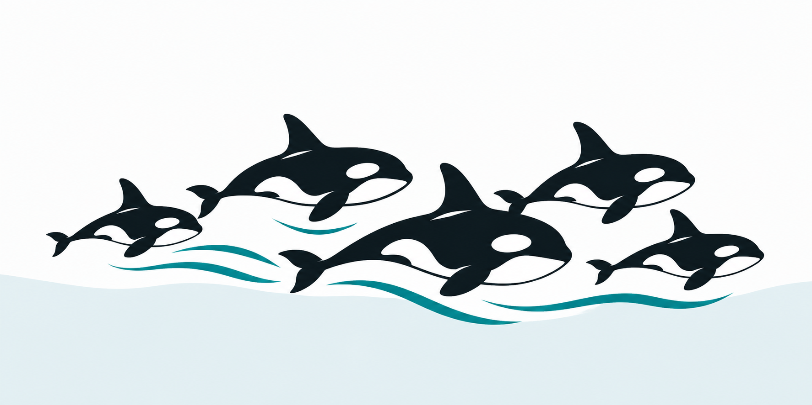

# OrcaBench

## WIP

OrcaBench is a private benchmark for coding agents and their subagents. Two maintainers independently compare anonymous outputs and explain which they would use in their projects. We plan to publish the tasks, outputs, checks, and votes, including disagreements.

Human votes determine preference scores. Automated checks, cost, and runtime are reported separately. The scores reflect our tasks and preferences.

So far, this repository contains research and a proposed evaluation protocol. There is no runner or benchmark data yet.

## Start here

- [Research](research/README.md) explains the choices so far.
- [Evaluation protocol](research/protocol.md) defines the proposed tasks, blind judging, and scoring.
- [Integrations](research/integrations.md) covers model routes, costs, and gaps in worker usage accounting.
- [Roadmap](research/roadmap.md) lists the next steps and their completion criteria.

Next is a small, reproducible OpenCode test with a solo agent and a controller with workers.

Then we will prepare two tasks and practice blind judging. The proposed screen expands to six tasks across eight configurations, for 48 runs. Finalists will need confirmation on fresh tasks.

## Ideas and scope

[Open an issue](https://github.com/KyleDerZweite/orcabench/issues) to propose a task, report an integration problem, or suggest an experiment. Explain what we would learn and how to check the result.

OrcaBench grew out of research for [LiteBench](https://github.com/KyleDerZweite/litebench), a separate writing benchmark.

## License

[MIT](LICENSE). Linked papers, software, and websites retain their own licenses.
